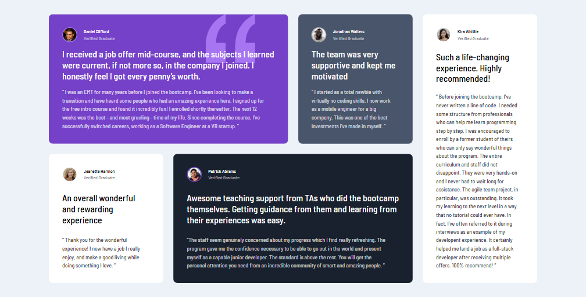

# Frontend Mentor - Testimonials grid section solution

This is a solution to the [Testimonials grid section challenge on Frontend Mentor](https://www.frontendmentor.io/challenges/testimonials-grid-section-Nnw6J7Un7). Frontend Mentor challenges help you improve your coding skills by building realistic projects.

## Table of contents

- [Overview](#overview)
  - [The challenge](#the-challenge)
  - [Screenshot](#screenshot)
  - [Links](#links)
- [My process](#my-process)
  - [Built with](#built-with)
  - [What I learned](#what-i-learned)
  - [Continued development](#continued-development)
  - [Useful resources](#useful-resources)
- [Author](#author)

## Overview

### The challenge

The challenge was to build out this testimonials grid section and get it looking as close to the design as possible.

### Screenshot



### Links

- Solution URL: [Solution](https://artemkotko14.github.io/testimonials_grid_section/)

## My process

### Built with

- Semantic HTML5 markup
- Flexbox
- CSS Grid
- Mobile-first workflow
- BEM
- SASS

### What I learned

I learned how to add image to background and adjust it to my needs:

```css
background-image: url("/images/bg-pattern-quotation.svg");
background-repeat: no-repeat;
background-position: top right 1.5rem;
background-size: 7rem 7.4rem;
```

### Continued development

In my future projects I want to focus on making responsive designs with CSS Grid and using Sass extension.

### Useful resources

- [Grid Garden](cssgridgarden.com) - This great game helped me understand CSS Grid.

## Author

- Github - [Artem Kotko](https://github.com/artemkotko14)
- Frontend Mentor - [@artemkotko14](https://www.frontendmentor.io/profile/artemkotko14)
